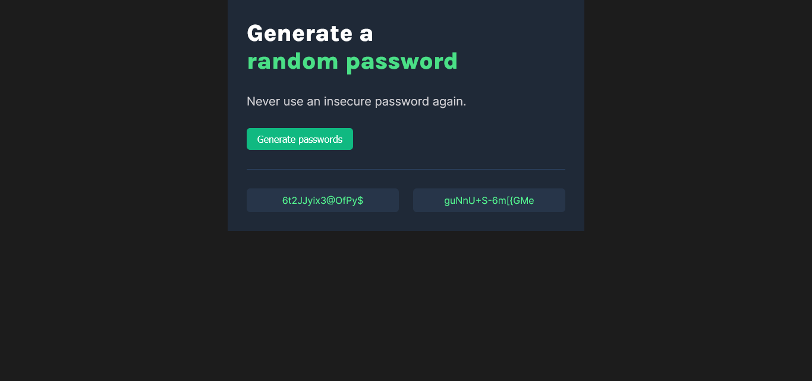

# Scrimba Bootcamp - Solo Projects

This is a solution to the [M3 - Password Generator](https://scrimba.com/learn/frontend/solo-project-pro-password-generator-cR9B46Sg).

## Screenshot

## Links

- Live Site: [Netlify](https://courageous-froyo-a57937.netlify.app/)
- Codebase: [Github](https://github.com/abilioassis/password-generator)
- Code review: [Scrimba](https://scrimba.com/scrim/co2434cb794e2cf6c21dd6b8a)

## Built with

- Semantic HTML5 markup.
- Flexbox.
- No frameworks (only pure HTML and CSS 🏅).

## Author

- [Abilio Assis](https://www.linkedin.com/in/abilio-assis/)
